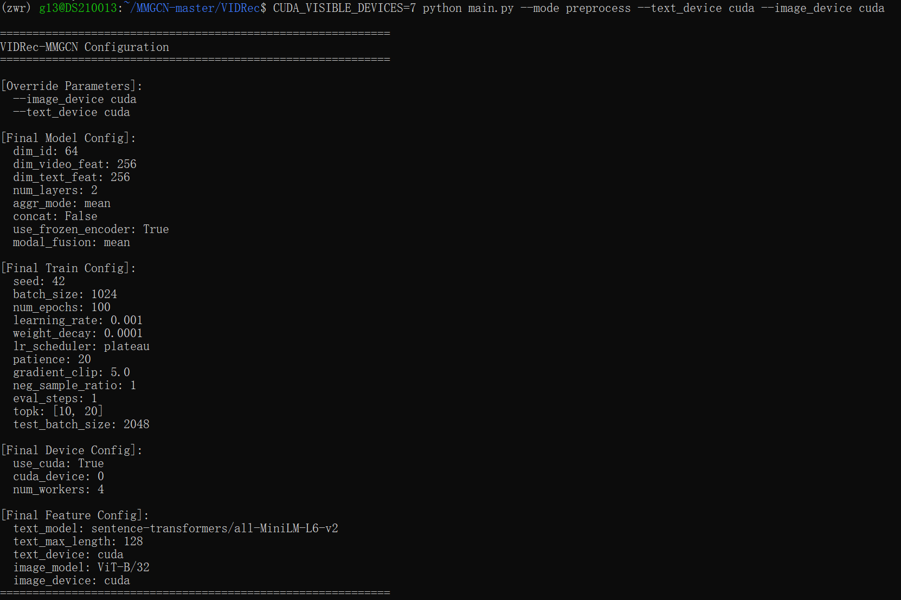
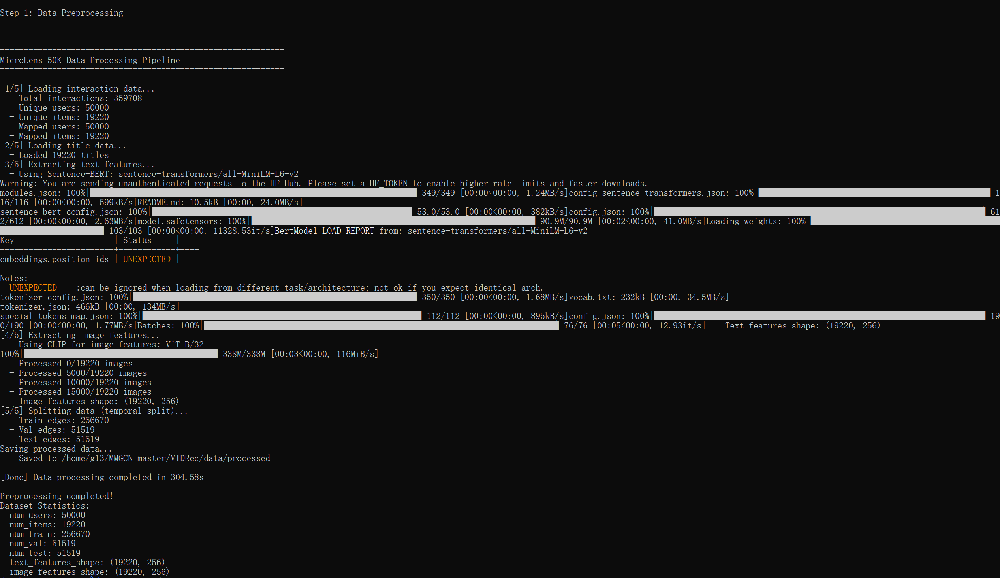
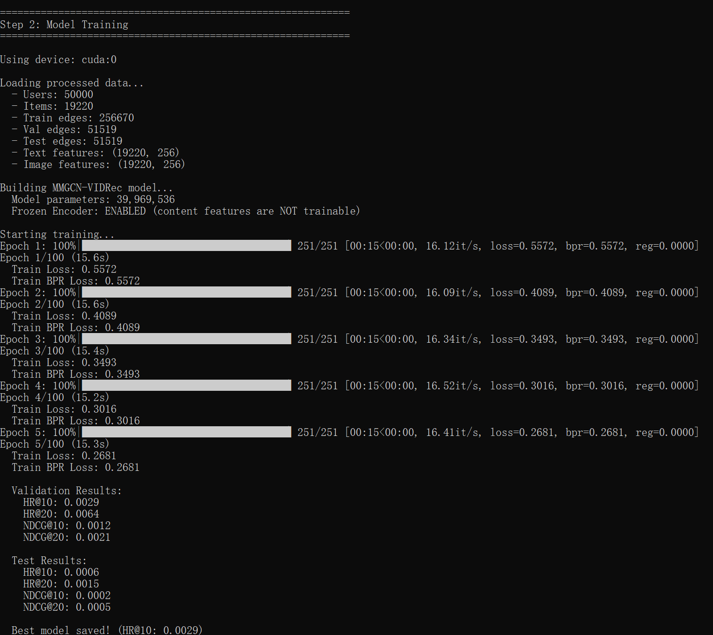
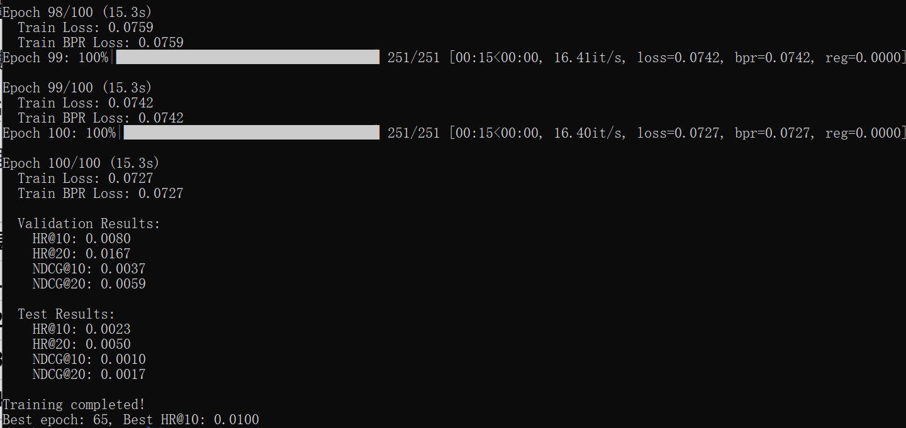
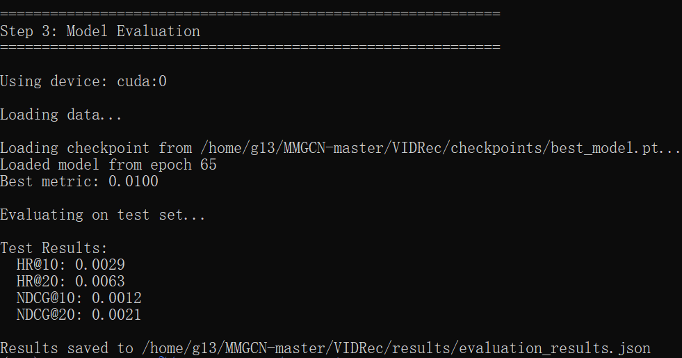

# VIDRec-MMGCN: Multi-modal Graph Convolution Network for Video Recommendation

基于 MicroLens-50K 数据集的 MMGCN (ID + Video, Frozen Encoder) 实现，用于短视频推荐。

## 项目概述

本项目实现了 **VIDRec-MMGCN** 模型，融合 ID 侧协同过滤信号和多模态内容特征，通过图卷积网络进行短视频推荐。

### 核心特性

- **MMGCN (Multi-modal Graph Convolution Network)**: 为每个模态构建独立的用户-物品二部图
- **VIDRec (Video-as-Feature)**: 冻结内容编码器，仅更新 ID embedding 和图网络参数
- **多模态融合**: 支持视觉（封面图像）和文本（标题）特征的融合
- **BPR Loss**: 使用贝叶斯个性化排序损失进行训练

## 数据集

使用 [MicroLens-50K](https://github.com/westlake-repl/MicroLens) 数据集，包含：
- 50,000+ 用户
- 19,000+ 视频
- 360,000+ 交互记录
- 视频封面图像
- 视频标题文本

## 项目结构

```
VIDRec/
├── config.py              # 配置文件
├── main.py                # 主入口脚本
├── README.md              # 本文档
│
├── models/                # 模型定义
│   ├── __init__.py
│   ├── basemodel.py       # 基础组件（GCN层、融合模块）
│   └── mmgcn_vidrec.py    # MMGCN-VIDRec 主模型
│
├── utils/                 # 工具模块
│   ├── __init__.py
│   ├── data_loader.py     # 数据加载与预处理
│   └── train_eval.py      # 训练与评估
│
├── data/                  # 预处理后数据
│   └── processed/
│       ├── train_edges.npy
│       ├── val_edges.npy
│       ├── test_edges.npy
│       └── ...
│
├── features/              # 提取的特征
│   ├── text_features.npy
│   └── image_features.npy
│
└── checkpoints/           # 模型检查点
    └── best_model.pt
```

### 短视频特征预处理（文本 + 视频封面）





### 训练





### 评估



```

## 环境依赖

```bash
torch==2.9.1+cu126
numpy==2.3.5
pandas==3.0.1
scipy==1.17.1
scikit-learn==1.8.0
pillow==12.0.0
tqdm==4.67.3
```

### 可选依赖（用于特征提取）

```bash
# 文本特征提取
pip install sentence-transformers

# 图像特征提取
pip install ftfy regex tqdm
pip install git+https://github.com/openai/CLIP.git
```

## 快速开始

### 1. 数据预处理

```bash
cd VIDRec
python main.py --mode preprocess
```

这将：
- 加载 MicroLens-50K 交互数据和元数据
- 提取视频封面图像特征（使用 CLIP 或随机初始化）
- 提取视频标题文本特征（使用 Sentence-BERT 或随机初始化）
- 按时间划分训练集/验证集/测试集
- 保存预处理后的数据到 `data/processed/` 和 `features/` 目录

### 2. 训练模型

```bash
python main.py --mode train
```

训练配置（可在 `config.py` 中修改）：
- ID embedding 维度: 64
- GCN 层数: 2
- Batch size: 1024
- 学习率: 1e-3
- 训练轮数: 100
- 早停耐心: 20

### 3. 评估模型

```bash
python main.py --mode eval
```

评估指标：
- HR@10, HR@20 (Hit Ratio)
- NDCG@10, NDCG@20 (Normalized Discounted Cumulative Gain)

## 模型架构

```
┌─────────────────────────────────────────────────────────────┐
│                    MMGCN-VIDRec                              │
├─────────────────────────────────────────────────────────────┤
│                                                              │
│  ┌──────────────┐         ┌──────────────┐                  │
│  │ Visual GCN   │         │  Text GCN    │                  │
│  │ (Cover Img)  │         │  (Title)     │                  │
│  └──────┬───────┘         └──────┬───────┘                  │
│         │                        │                          │
│         └──────────┬─────────────┘                          │
│                    ▼                                        │
│           ┌───────────────┐                                │
│           │ Modal Fusion   │                                │
│           │ (Mean/Weighted/ │                                │
│           │    Gating)     │                                │
│           └───────┬────────┘                                │
│                   │                                        │
│         ┌────────┴────────┐                               │
│         ▼                  ▼                                │
│  ┌─────────────┐   ┌─────────────────┐                      │
│  │ID Embedding │ + │Content Features │                      │
│  │  (Learnable)│   │    (Frozen)    │                      │
│  └─────────────┘   └─────────────────┘                      │
│                                                              │
└─────────────────────────────────────────────────────────────┘
```

### 输入特征

| 模态 | 特征来源 | 维度 | 说明 |
|------|----------|------|------|
| ID侧 | User/Item ID Embedding | 64 | 可学习参数 |
| Visual | 视频封面图像 | 256 | 使用 CLIP 提取或随机初始化，**训练时冻结** |
| Text | 视频标题 | 256 | 使用 Sentence-BERT 提取或随机初始化，**训练时冻结** |

### 图建模

为每个模态构建独立的用户-物品二部图：
- **节点**: User + Item
- **边**: 交互关系（无向图）
- **消息传递**: GCN 聚合邻居信息
- **融合**: 多模态表示加权融合

## 核心代码说明

### 模型定义 (`models/mmgcn_vidrec.py`)

```python
model = MMGCNVIDRec(
    num_users=50000,
    num_items=19000,
    train_edge_index=train_edges,
    v_feat=image_features,    # 视觉特征 (Frozen)
    t_feat=text_features,      # 文本特征 (Frozen)
    dim_id=64,
    dim_latent=256,
    num_layers=2,
    aggr_mode='mean',
    modal_fusion='mean',
    use_frozen_encoder=True,
)
```

### 训练流程

1. **数据加载**: 加载预处理后的交互数据和多模态特征
2. **负采样**: 对每个正样本随机采样一个负样本
3. **前向传播**: 计算用户和物品的融合表示
4. **BPR Loss**: 最大化正样本分数 - 负样本分数
5. **反向传播**: 仅更新 ID embedding 和 GCN 参数

### Frozen Encoder 约束

```python
# 冻结内容特征
for name, param in model.named_parameters():
    if 'v_feat' in name or 't_feat' in name:
        param.requires_grad = False
```

## 配置说明

所有配置位于 `config.py`：

### 模型配置

```python
MODEL_CONFIG = {
    'dim_id': 64,              # ID embedding 维度
    'dim_video_feat': 256,     # 视觉特征维度
    'dim_text_feat': 256,      # 文本特征维度
    'num_layers': 2,           # GCN 层数
    'aggr_mode': 'mean',       # 聚合方式
    'modal_fusion': 'mean',    # 模态融合方式
    'use_frozen_encoder': True,# 冻结内容编码器
}
```

### 训练配置

```python
TRAIN_CONFIG = {
    'seed': 42,
    'batch_size': 1024,
    'num_epochs': 100,
    'learning_rate': 1e-3,
    'weight_decay': 1e-4,
    'patience': 20,
    'topk': [10, 20],
}
```

## 扩展与改进

### 1. 添加更多模态

```python
# 在 models/mmgcn_vidrec.py 中添加音频模态
self.a_feat = nn.Parameter(audio_features, requires_grad=False)
self.a_gcn = ModalGCN(...)

# 修改 forward 方法中的模态融合
```

### 2. 端到端训练（VideoRec）

```python
# 解冻内容编码器
for param in model.content_encoder.parameters():
    param.requires_grad = True
```

### 3. 其他融合方式

```python
# 尝试不同的模态融合策略
'modal_fusion': 'weighted'  # 加权融合
'modal_fusion': 'gating'   # 门控融合
```

## 参考论文

- [MMGCN: Multi-modal Graph Convolution Network for Personalized Recommendation of Micro-video](https://arxiv.org/abs/1908.02159) (ACM MM 2019)
- [MicroLens: A Content-Driven Micro-Video Recommendation Dataset at Scale](https://arxiv.org/abs/2309.15379)

## 致谢

本项目参考了以下开源项目：
- [MMGCN](https://github.com/weiyinwei/MMGCN)
- [MicroLens](https://github.com/westlake-repl/MicroLens)
